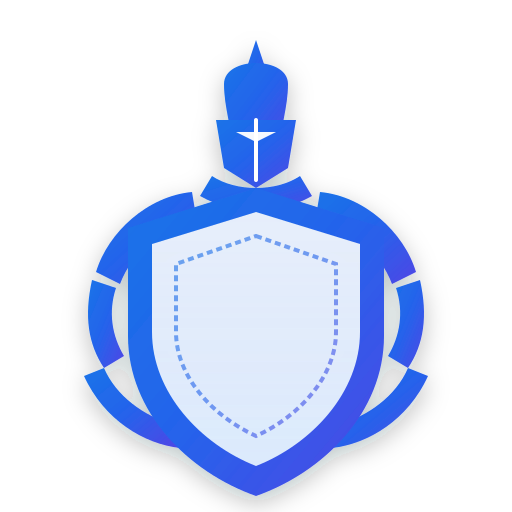
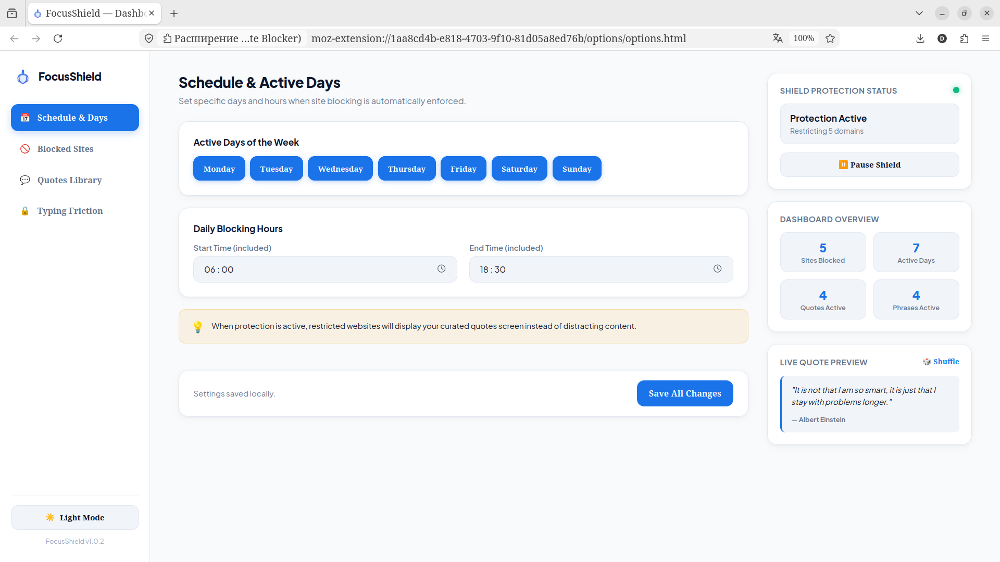
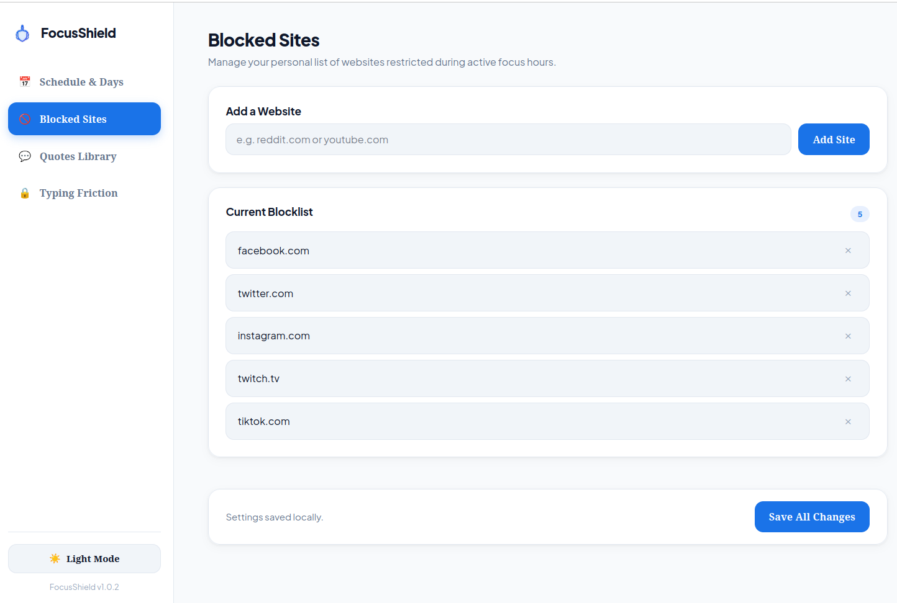
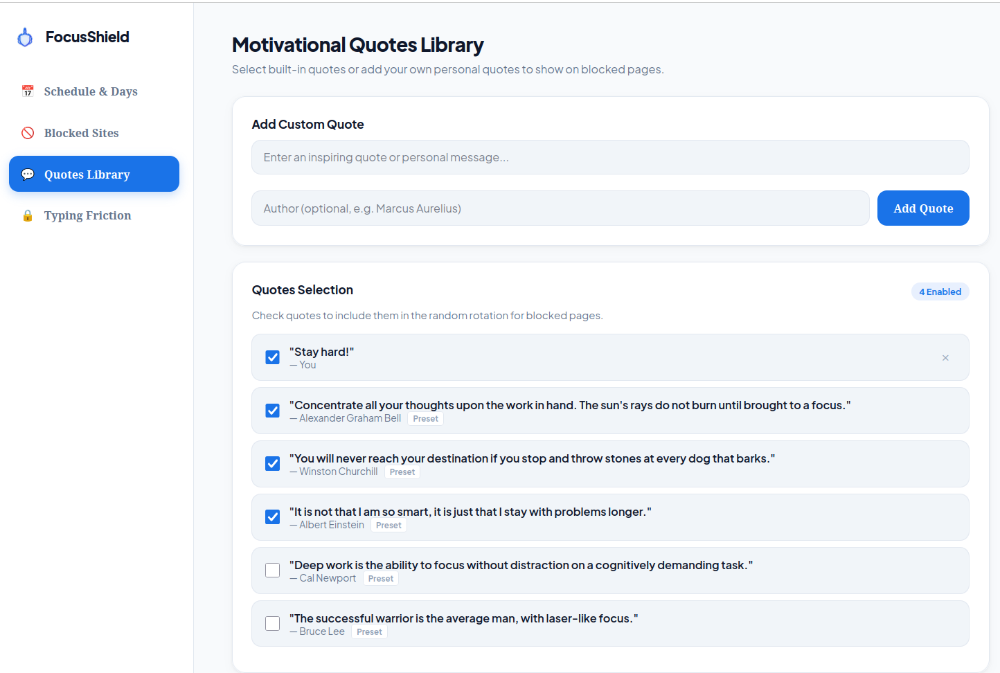
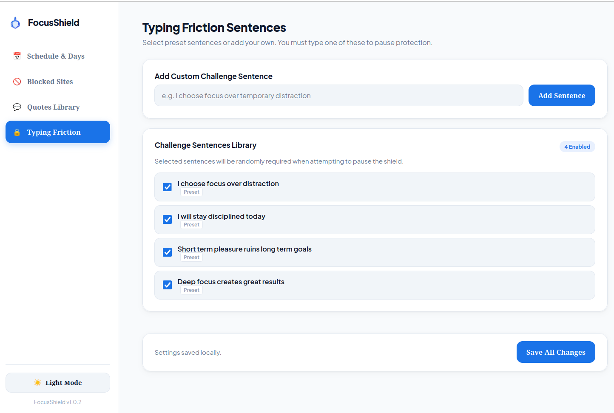

<div align="center">

  

  # 🛡️ FocusShield

  **A modern, distraction-free browser extension built for deep work and laser focus.**
  [](https://addons.mozilla.org/ru/firefox/addon/focusshield-site-blocker/)
  [](https://developer.mozilla.org/en-US/docs/Mozilla/Add-ons/WebExtensions/manifest.json)
  [](https://addons.mozilla.org/)
  [](https://github.com/)

</div>

---
## 📖 Overview
  
**FocusShield** is an elegant, privacy-first browser extension designed to help you stay disciplined during work hours. By combining customizable focus schedules, dynamic website blocking, anti-cheat typing challenges, and inspirational quotes, FocusShield turns mindless tab-opening into mindful productivity.

---

## 📸 Screenshots & Previews

### 📅 1. Schedule & Active Focus Hours
Configure active work days and daily time windows when site restrictions are automatically enforced.

<div align="center">
  
</div>

---

### 🚫 2. Dynamic Blocklist Management
Easily add or remove distracting domains (e.g., social media, video streaming) with real-time domain counting.

<div align="center">
  
</div>

---

### 💬 3. Motivational Quotes Library
Select from built-in preset quotes or write your own personal goals. Checked quotes appear randomly on restricted page screens.

<div align="center">
  
</div>

---

### 🔒 4. Anti-Cheat Typing Friction
Prevent impulsive shield pausing. To pause protection, you must type a randomized or custom discipline sentence.

<div align="center">
  
</div>

---

## ✨ Key Features

* **🎨 Google Gemini-Inspired UI:** Modern minimalist aesthetic with full **Light ☀️ and Dark 🌙 theme support** across all views.
* **📊 Live Insights Dashboard:** Real-time protection status indicator, master pause button, and focus statistics.
* **🛡️ Dynamic Website Blocking:** Block entire domains without restarting the browser.
* **🔒 Typing Friction Challenge:** Pause protection only after typing a disciplined phrase accurately.
* **💬 Quotes & Citations Manager:** Preset + custom quote selection with equal-distribution random rotation.
* **📅 Scheduled Enforcement:** Automatic activation based on active weekdays and time ranges.
* **⚡ Instant Tab Redirection:** Automatically scans and intercepts currently open restricted tabs when protection turns on.
* **🔒 100% Private & Offline:** Zero analytics, zero tracking, and no external servers. All settings stay locally on your device.

---

## 🛠️ Project Structure

```text
FocusShield/
├── manifest.json              # WebExtension Manifest V3 configuration
├── background/
│   └── background.js          # Tab interceptor & scheduled alarm engine
├── options/
│   ├── options.html           # 2-Column Dashboard & Settings page
│   ├── options.css            # Gemini Light/Dark design system
│   └── options.js             # Settings state manager & statistics
├── popup/
│   ├── popup.html             # Toolbar quick-action menu
│   ├── popup.css              # Popup styling
│   └── popup.js               # Quick domain add & status toggling
├── views/
│   ├── blocked.html           # Restricted landing screen with quotes
│   ├── blocked.css            # Restricted screen styles
│   ├── blocked.js             # Random enabled quote picker
│   ├── challenge.html         # Anti-cheat typing challenge screen
│   ├── challenge.css          # Challenge typing interface styles
│   └── challenge.js           # Real-time typing verification logic
├── icons/
│   ├── icon.svg               # Vector master icon
│   ├── icon16.png             # Toolbar icon
│   ├── icon32.png             # Retina toolbar icon
│   ├── icon48.png             # Extensions manager icon
│   ├── icon128.png            # Installation dialog icon
│   └── icon512.png            # Marketplace store listing icon
└── docs/
    └── screenshots/           # UI documentation preview images
```

---

## 🚀 Installation & Local Development

### For Mozilla Firefox:
1. Open Firefox and navigate to `about:debugging`.
2. Click **"This Firefox"** on the left menu.
3. Click **"Load Temporary Add-on..."**.
4. Select the [`manifest.json`](manifest.json) file inside this repository.

### For Google Chrome / Chromium:
1. Open Chrome and navigate to `chrome://extensions`.
2. Enable **"Developer mode"** (toggle in top-right corner).
3. Click **"Load unpacked"**.
4. Select the root `FocusShield/` directory.

---

## 🛡️ Privacy & Permissions

* `storage`: Stores your blocklist, schedules, quotes, and theme preferences locally.
* `declarativeNetRequest` / `tabs`: Intercepts and redirects blocked URLs to the quotes landing screen.
* `alarms`: Checks active schedule hours at regular intervals without draining battery.
* **No external network requests are ever made.**

---

